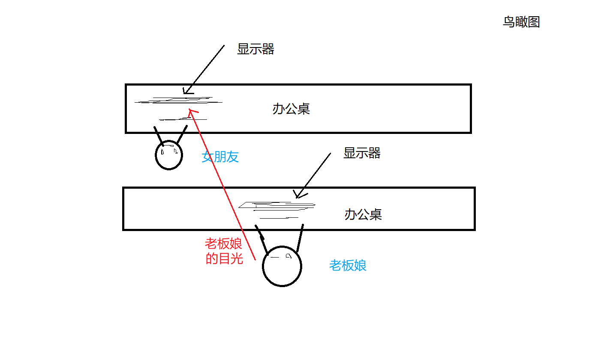
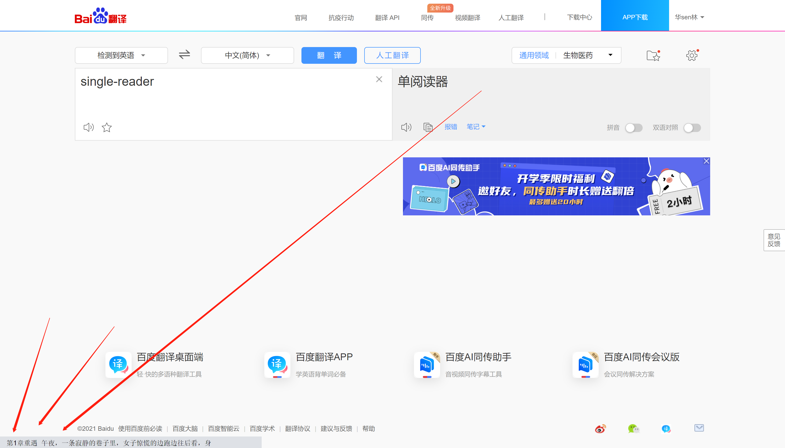
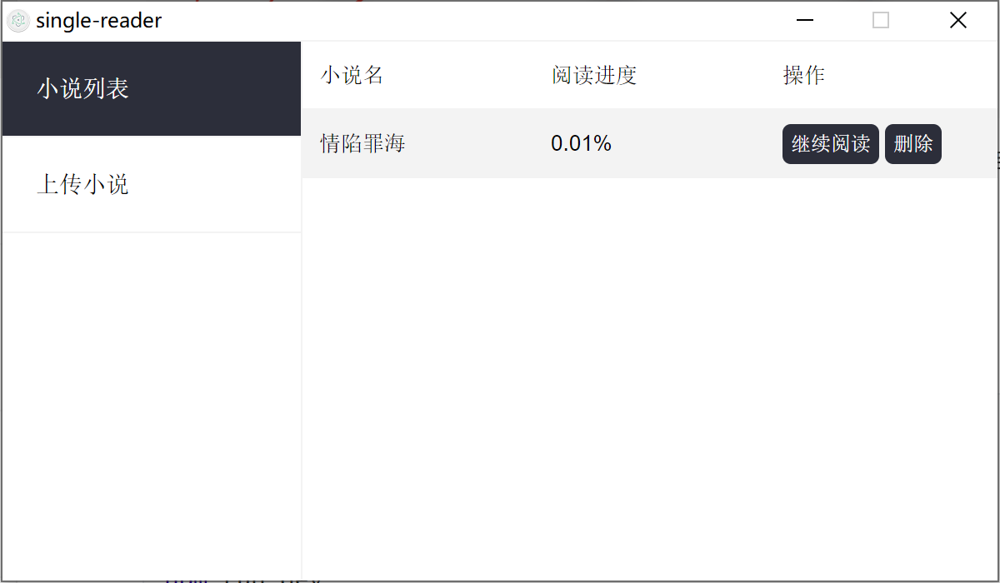

# 超隐蔽的单行阅读器

> 给女朋友开发的上班摸鱼用的单行阅读器

## 背景

由于女朋友工作效率太高，经常半天就完成了一天的工作量，所以想消磨消磨时间，但是老板娘就坐后面，一抬头就能看到女朋友的电脑，所以不能名目张胆的摸鱼，于是就有了这个“超隐蔽的单行阅读器”。



## 使用方式

1. 安装exe打开后会自动吸附在屏幕的左下角，假装是一个浏览器的地址显示区，配合浏览器使用更隐蔽



2. 只有鼠标放置在阅读器上才会显示小说正文，当鼠标离开时会显示一串地址，已达到混淆的效果

3. 电脑的“←”、“→”键可以进行上一页下一页操作

4. 右键阅读区可打开菜单，可进行基础的增加删除小说操作

   

   

## 预览效果

   

## 安装包下载链接

https://raw.githubusercontent.com/LevineHua/single-reader/main/static/single-reader%20Setup%200.0.1.exe

## 运行方式

``` bash
# install dependencies
npm install 或 yarn

# serve with hot reload at localhost:9080
npm run dev 或 yarn dev

# build electron application for production
npm run build 或 yarn build


```


