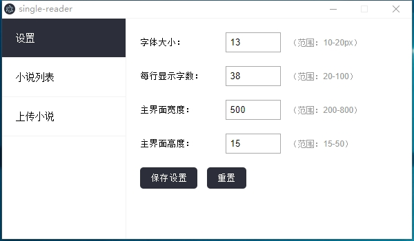
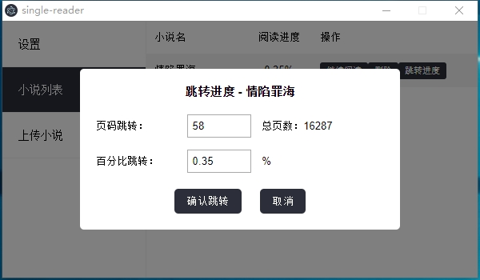

# 超隐蔽的单行阅读器

> 给女朋友开发的上班摸鱼用的单行阅读器

## 背景

由于女朋友工作效率太高，经常半天就完成了一天的工作量，所以想消磨消磨时间，但是老板娘就坐后面，一抬头就能看到女朋友的电脑，所以不能名目张胆的摸鱼，于是就有了这个“超隐蔽的单行阅读器”。

## 使用方式

1. 安装exe打开后会自动吸附在屏幕的左下角，假装是一个浏览器的地址显示区，配合浏览器使用更隐蔽

2. 只有鼠标放置在阅读器上才会显示小说正文，当鼠标离开时会显示一串地址，已达到混淆的效果

3. 电脑的“←”、“→”键可以进行上一页下一页操作

4. 右键阅读区可打开菜单，可进行基础的增加删除小说操作

   

   

## 预览效果

   

## 安装包下载链接

https://raw.githubusercontent.com/LevineHua/single-reader/main/static/single-reader%20Setup%200.0.1.exe

## update by chentieli
首先感谢LevineHua搭建的基础功能，我在这个基础上做了一些额外的补充功能，具体新增以下内容。
1. 新增设置界面，支持以下配置项：
   1) 字体大小配置
   2) 每行显示字数配置
   3) 主界面宽度配置
   4) 主界面高度配置
   

2. 增加主界面可拖动功能，鼠标左键指向小说窗口按住即可实现拖拽至桌面的任意位置。
   

3. 小说列表中增加跳转功能。
   

4. 目前本地debug调试时在快速翻页的时候会出现error弹框，目前分析是写持久化文件的插件频繁写文件导致的。暂时还没有解决。但是通过build出来的exe安装包测试，在快速翻页的时候没有错误，暂时不知道啥原因。不过可以满足基本使用需求。
   

5. 修改package.json，解决高版本的node运行构建问题。

## v1.0.1版本安装包下载链接
https://github.com/chentieli/single-reader/blob/branch-single/static/single-reader%20Setup%201.0.1.exe