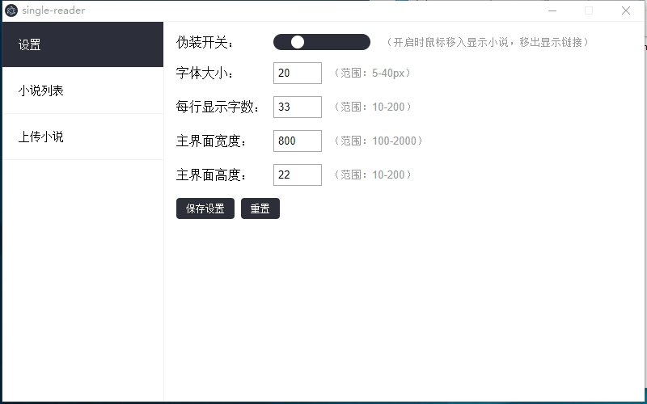
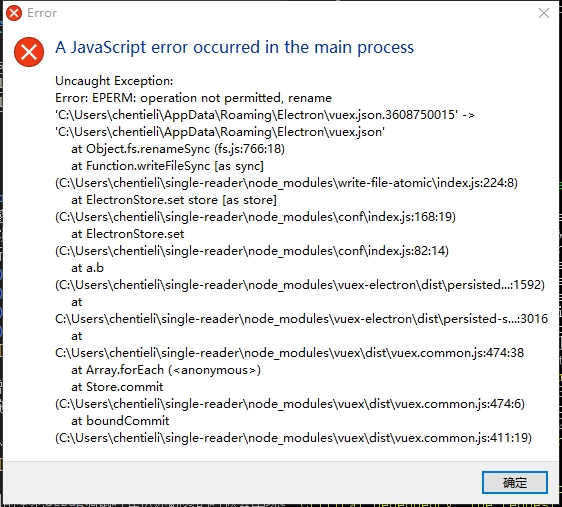

# 超隐蔽的单行阅读器

> 给老婆开发的上班摸鱼用的单行阅读器

## 背景

由于女朋友工作效率太高，经常半天就完成了一天的工作量，所以想消磨消磨时间，但是老板娘就坐后面，一抬头就能看到女朋友的电脑，所以不能名目张胆的摸鱼，于是就有了这个“超隐蔽的单行阅读器”。

## 使用方式

1. 安装exe打开后会自动吸附在屏幕的左下角，假装是一个浏览器的地址显示区，配合浏览器使用更隐蔽

2. 只有鼠标放置在阅读器上才会显示小说正文，当鼠标离开时会显示一串地址，已达到混淆的效果

3. 电脑的“←”、“→”键可以进行上一页下一页操作
  - 左右方向键（←上一页，→下一页）逐页翻页
  - PageUp/PageDown键快速翻页（每次翻10页）
 
## update by chentieli
首先感谢LevineHua搭建的基础功能，我在这个基础上做了一些额外的补充功能、修复崩溃的错误，最新版本支持了epub文件导入，以及按照章节跳转的功能。
1. 新增设置界面，支持以下配置项：
   1) 伪装开关
   2) 字体大小配置
   3) 每行显示字数配置
   4) 主界面宽度配置
   5) 主界面高度配置
   6) 阅读界面坐标可自由拖动

   

2. 增加主界面可拖动功能，鼠标左键指向小说窗口按住即可实现拖拽至桌面的任意位置。

   

3. 新增epub格式文件支持，支持解析epub文件的章节目录。并针对epub支持章节跳转功能。
   

4. 目前本地debug调试时在快速翻页的时候会出现error弹框，分析是写持久化文件的插件频繁写文件导致的。最新版本已经解决快速翻页导致的错误问题。

   

5. 修改package.json，解决高版本的node运行构建问题。

## v1.0.1版本安装包下载链接
https://github.com/chentieli/single-reader/blob/branch-single/static/single-reader%20Setup%201.0.1.exe